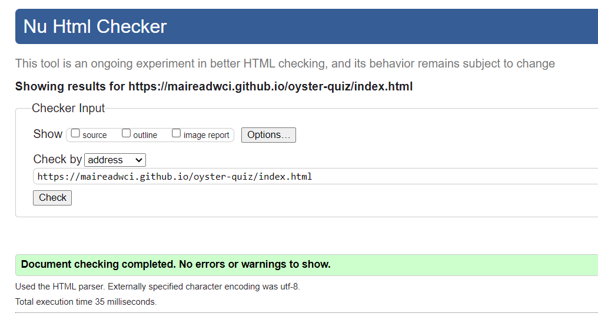
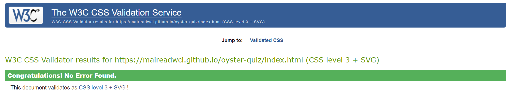
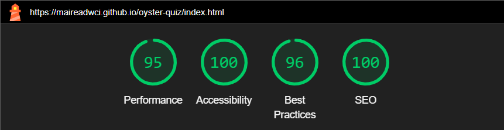

# Oyster Quiz

# Users Experience Design

## User Stories
As a user of this quiz:
* I would like to gain more knowledge about oysters.
* I would like to play a quiz that is easy to navigate.
* I would like to play against the clock.
* I would like visual feedback throughout the quiz, ie. my score and time left. 
* I would like to save my score and see how it compares with others.

## Colour Scheme

A combination of colours were chosen to represent the feel of the ocean and remain on theme with the brands identity.

## Wireframes

<a href="https://balsamiq.com/" rel="nofollow">Balsamiq</a> was used to create a preview of the layout of this Quiz. Wireframes where produced for each area of the quiz in desktop and mobile views.

### Rules Area 
 

### Quiz Area
 

### Result Area
 

# Technologies Used

## Languages

* HTML
* CSS
* JavaScript

## Frameworks, Libraries and Programs Used
<ul>
<li><a href="https://fontawesome.com/" rel="nofollow">Font Awesome</a></li>

This was used to get decorative icons. 

<li><a href="https://balsamiq.com/" rel="nofollow" alt="balsamiq">Balsamiq</a></li>

This was used to create wireframes for the project.

<li><a href="https://github.com/" alt="github">GitHub</a></li>

Github was used to store and share the project. 

<li><a href="https://gitpod.io/" rel="nofollow" alt="gitpod">GitPod</a></li>

IDE for development.

<li><a href="http://ami.responsivedesign.is/#" rel="nofollow" alt="am-i-responsive">Am I Responsive?</a></li>

Used to test the sites responsiveness on differnt devices.

<li><a href="https://developer.chrome.com/docs/devtools/" rel="nofollow" alt="chrome-dev-tools">Chrome DevTools</a></li>

Used throughout the project to review code and test reponsiveness.

<li><a href="https://validator.w3.org/" rel="nofollow" alt="html validator">W3C Markup Validator</a></li>

This was used to validate the html in the website.

<li><a href="https://jigsaw.w3.org/css-validator/" rel="nofollow" alt="CSS validator">W3C CSS Validator</a></li>

This was used to validate the CSS in the website. 

<li><a href="https://jshint.com/" rel="nofollow" alt="JavaScript validator">W3C CSS Validator</a></li>

This was used to validate the JavaScript in this quiz. 

</ul>

# Features 

## Header And Logo

Featured across the site, the header contains a clickable logo, that will return the user to the home page.

 

## Quiz Rules Area

The quiz rules area welcomes the user to the quiz, goes through some rules for the quiz and contains the start quiz button. 

 

## Quiz Area

* The quiz area contains a count for which question the user is on.
*  A question area is present and the choice of Three answer buttons is also available. 
* Users score is tracked in the bottom left of this area. The users score will be 10 points for a correct answer plus a time bonus for answering faster.
* A countdown timer is present for each question, once Five seconds are left this timer will turn red. 
* When the user selects an answer the next question will show. 
* If the countdown timer runs out the next question will show. 

 

## Result Area 

The result area gives information to the user such as:
* Informing them they have finished the quiz.
* Displaying the users final score.
* A try again button, which restarts the quiz. 
* The highscore button, which takes the user to the highscore area.
* The show correct answers button which gives a list of all quiz questions and their corresponding answer. 

## Correct Answers

* The corrrect answer for the corresponding question is highlighted in green. 

## Save Score Area

The save score area is comprised of:
* An input where the user can enter their username.
* The users score dynamically  generated.
* The save score button which will direct the user to the highscore list. 

## Highscore Area

* The highscore area displays a scrollable list of all users scores ranked highest to lowest. 

## Footer 

* The footer can be seen throughout the quiz game and is positioned across the bottom of the screen. 
* It contains a link to my GitHub. 

# Future Features
 
* The use of an API would have been nice to generate the questions, this would also allow for the order of the questions to be changed and randomly generated. 
* The ability to add social sharing would be advantageous.
* A visual progress bar to aid in informing the user of their progress. 
* It would be nice to have the users answer shown against the correct answer for any questions that where answered incorrectly. 
* Being able to skip a question and come back to it later would be a nice feature to add. 

# Testing

Testing of the functionality of the deployed site can be seen in the following tables. Each feature of the quiz has been tested with what is expected, what is the expected action to receive the outcome and the result, which is pass or fail. 

## Header and Logo

|Feature  | Expect  | Action | Result |
|--|--|--|--|
| Logo  | When the logo is clicked it will return the user to the rules area |Click logo at different points in quiz | Pass
 
## Rules area

|Feature | Expect | Action | Result |
|--|--|--|--|
| Start quiz button| Once clicked the start quiz button will direct the user to the quiz area, the count down timer will start and wait for the user to answer the first question | Click the start quiz button| Pass

## Quiz area

|Feature | Expect | Action | Result |
|--|--|--|--|
| Question counter | The question the user is on will be displayed | Click an answer button, note the question number change| Pass
| Question area | The question the user is on will change depending on user interaction | Click an answer button, note the question change | Pass
| Answer buttons | Once an answer is clicked the next question will show | Click any of the answer buttons, note the change in question| Pass
| Score | The score will increment with each correct answer and remain the same for an incorrect answer | Click the correct answer note the score given, click an incorrect answer note the score staying the same | Pass
| Score - bonus points | The faster the user answers a question the higher their score(base 10 plus 15 for a correct answer and so on) | Click multiple answers, note the change in score| Fail
| Timer | Timer will countdown from Fifteen for each question | Click an answer button to see the timer countdown for each new question| Pass
| Timer runout | When the timer runs out the next question will show and no score will be given | let the timer runout notice the question change and score remain the same | Pass
| Timer - turn red | Timer will turn red when there is 5 seconds left to answer | Allow the timer to decrement to 5 seconds notice the colour change| Pass 

## Result area

|Feature | Expect | Action | Result |
|--|--|--|--|
|Score| Players score is displayed correctly corresponding to the score achieved | Test different scores and checked with the score output | Pass
|Try again button| Once clicked the try again button will restart the quiz| Click the try again button| Pass
|Highscore button| Once clicked the highscore button will the the user to the save score area| Click the highscore button| Pass
|Show Correct Answers| Once clicked the show correct answers will display  the correct answers for the quiz| Click the show correct answers | Pass

## Save Score Area

|Feature | Expect | Action | Result |
|--|--|--|--|
|Username input| The user can enter a username| Enter username | Pass
| Save Score  - empty input| Once clicked with no username entered the save score button will alert the user that a username is needed| Click the save score button with no username selected | Pass
| Save score| Once clicked the users score will be placed into a list of highscores (in ascending order) and this will be displayed| Click the save score button| Pass

## Footer

|Feature | Expect | Action | Result |
|--|--|--|--|
| GitHub link | When clicked the GitHub icon will open a new window to my GitHub repository | Click the GitHub icon| pass

## Validator Testing

### HTML

[Nu Html Checker](https://validator.w3.org/nu/?doc=https%3A%2F%2Fmaireadwci.github.io%2Foyster-quiz%2Findex.html)

### CSS

[W3C validator](https://jigsaw.w3.org/css-validator/validator?uri=https%3A%2F%2Fmaireadwci.github.io%2Foyster-quiz%2Findex.html&profile=css3svg&usermedium=all&warning=1&vextwarning=&lang=en)

### Lighthouse Testing

# Deployment 
The site was deployed to GitHub pages. The steps to deploy are as follows:
1  Go to your repository on GitHub.
2. Click on the settings tab.
3. Under the code and automation section, choose pages.
5. Set branch as main and click save.
6. A link to the project will be seen at the top of the page.

The live link can be accessed here: [Oyster Quiz](https://maireadwci.github.io/oyster-quiz/index.html)

# credits

## content
https://www.funtrivia.com/trivia-quiz/Animals/The-Oyster-Great-Mother-of-Pearls-209801.html 
https://kupidonia.com/quiz-answers/quiz-oyster 

## code
map function: https://stackoverflow.com/questions/38364400/index-inside-map-function
timer: https://stackoverflow.com/questions/44314897/javascript-timer-for-a-quiz 
date.now(): https://www.w3schools.com/jsref/jsref_now.asp 
help with scoring: https://stackoverflow.com/questions/29022829/increment-score-using-javascript
Math.round: https://www.w3schools.com/js/js_math.asp 
Highscore: https://stackoverflow.com/questions/29370017/adding-a-high-score-to-local-storage 
local storage: https://stackoverflow.com/questions/60037063/how-to-save-scores-in-javascript-quiz
Sorting JavaScript array: https://stackoverflow.com/questions/55326268/how-to-sort-array-of-objects-with-foreach-loop-javascript  

## image
https://nypost.com/2023/10/13/woman-ate-48-oysters-on-a-date-what-happened-next-was-shocking/ 