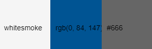
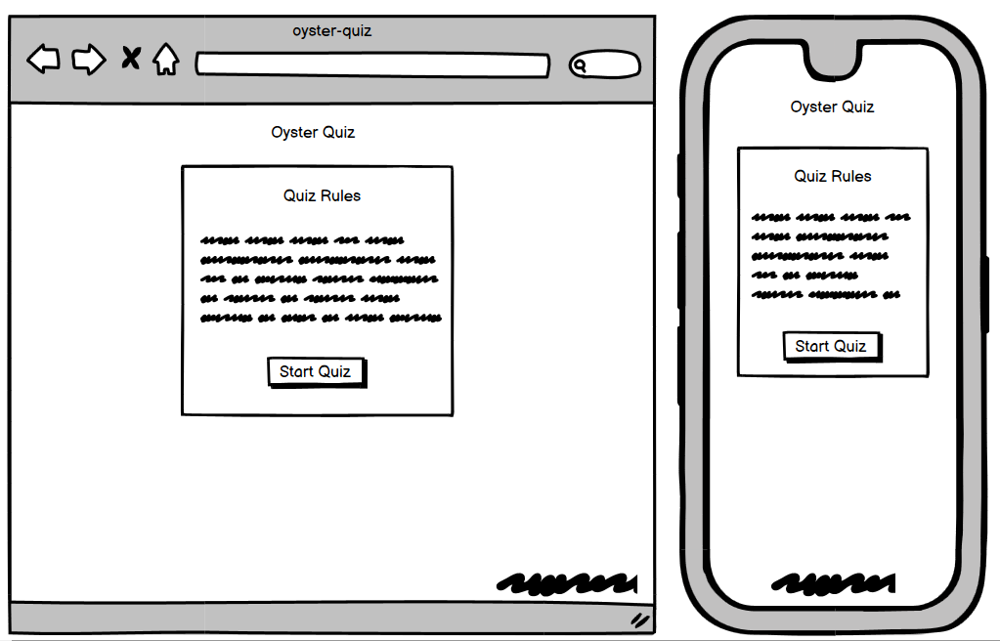
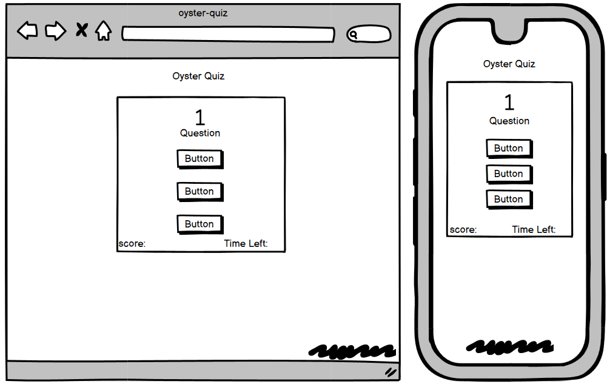
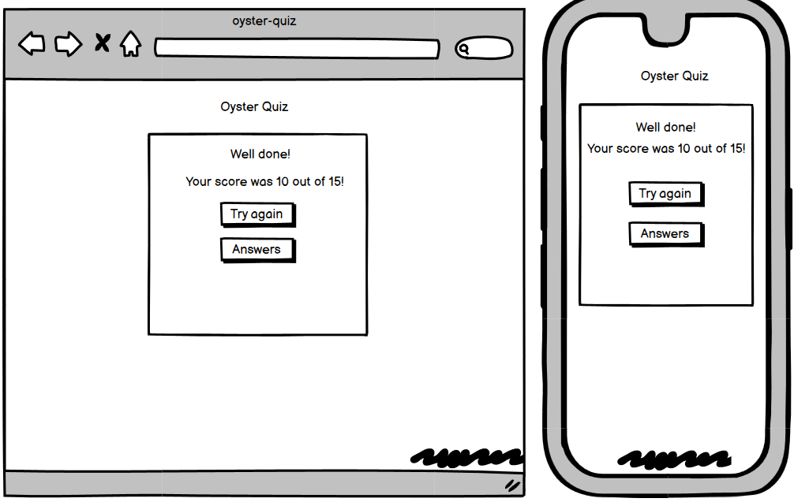
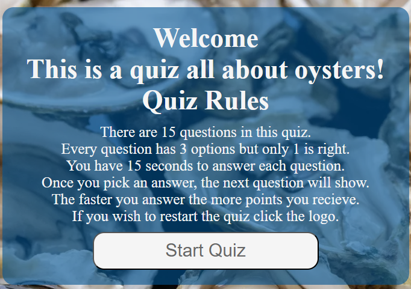
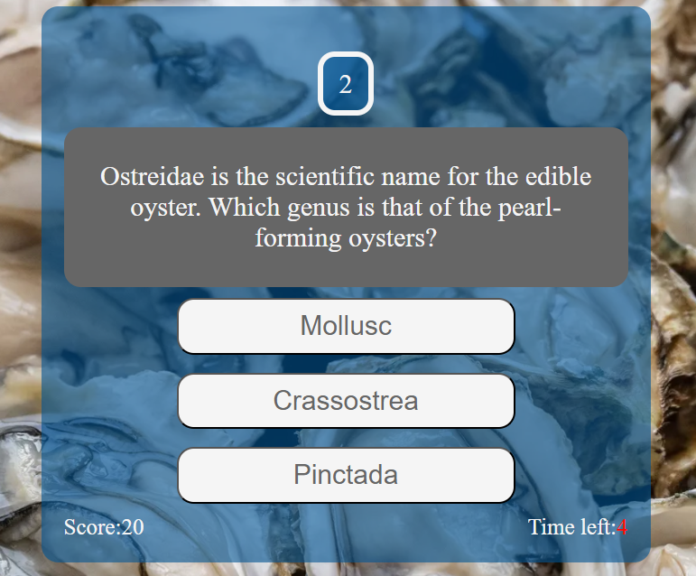
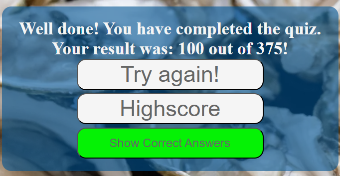
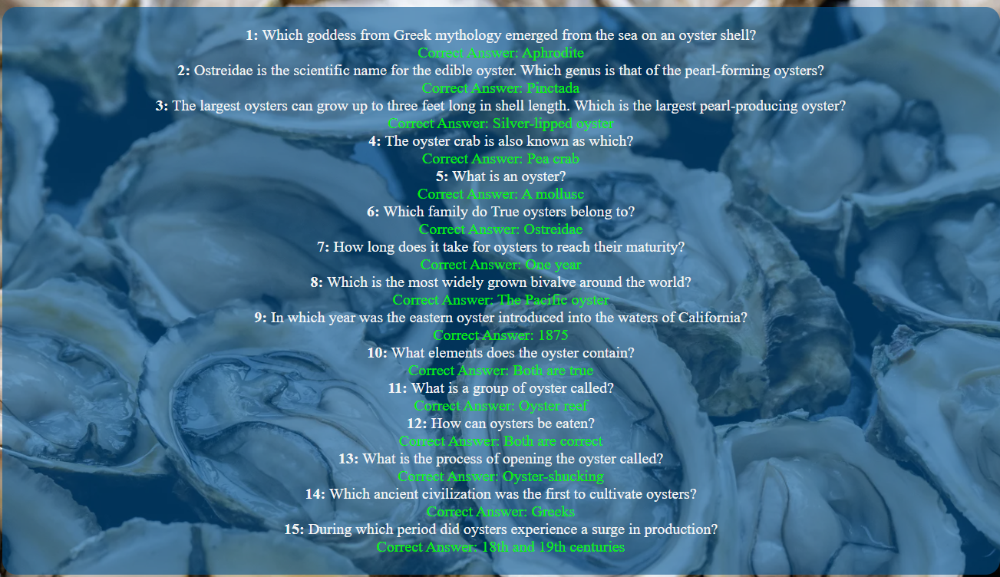
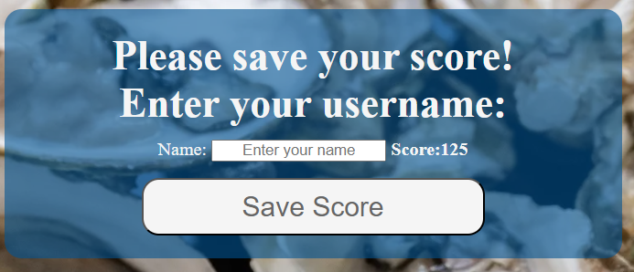
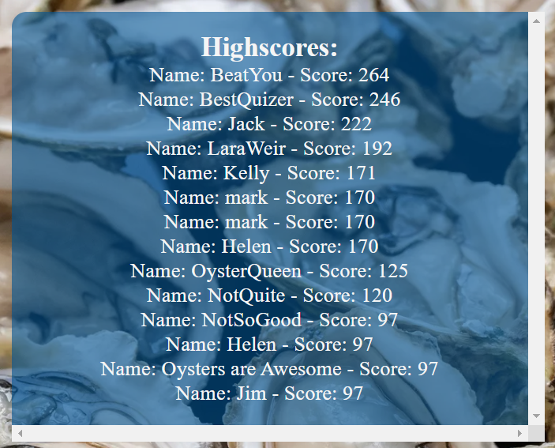

# Oyster Quiz

# Users Experience Design

## User Stories
As a user of this quiz:
* I would like to gain more knowledge about oysters.
* I would like to play a quiz that is easy to navigate.
* I would like to play against the clock.
* I would like visual feedback throughout the quiz, ie. my score and time left. 
* I would like to save my score and see how it compares with others.

## Colour Scheme

A combination of colours were chosen to represent the feel of the ocean and remain on theme with the brands identity.

## Wireframes

<a href="https://balsamiq.com/" rel="nofollow">Balsamiq</a> was used to create a preview of the layout of this Quiz. Wireframes where produced for each area of the quiz in desktop and mobile views

### Rules Area 
 

### Quiz Area
 

### Result Area
 
 
# Features 

## Header And Logo

Featured across the site, the header contains a clickable logo, that will return the user to the home page.

 

## Quiz Rules Area

The quiz rules area welcomes the user to the quiz, goes through some rules for the quiz and contains the start quiz button. 

 

## Quiz Area

* The quiz area contains a count for which question the user is on.
*  A question area is present and the choice of Three answer buttons is also available. 
* Users score is tracked in the bottom left of this area. The users score will be 10 points for a correct answer plus a time bonus for answering faster.
* A countdown timer is present for each question, once Five seconds are left this timer will turn red. 
* When the user selects an answer the next question will show. 
* If the countdown timer runs out the next question will show. 

 

## Result Area 

The result area gives information to the user such as:
* Informing them they have finished the quiz.
* Displaying the users final score.
* A try again button, which restarts the quiz. 
* The highscore button, which takes the user to the highscore area.
* The show correct answers button which gives a list of all quiz questions and their corresponding answer. 

## Correct Answers

* The corrrect answer for the corresponding question is highlighted in green. 

## Save Score Area

The save score area is comprised of:
* An input where the user can enter their username.
* The users score dynamically  generated.
* The save score button which will direct the user to the highscore list. 

## Highscore Area

* The highscore area displays a scrollable list of all users scores ranked highest to lowest. 

## Footer 

* The footer can be seen throughout the quiz game and is positioned across the bottom of the screen. 
* It contains a link to my GitHub. 

# Future Features
 
* The use of an API would have been nice to generate the questions, this would also allow for the order of the questions to be changed and randomly generated. 
* The ability to add social sharing would be advantageous.
* A visual progress bar to aid in informing the user of their progress. 
* It would be nice to have the users answer shown against the correct answer for any questions that where answered incorrectly. 
* Being able to skip a question and come back to it later would be a nice feature to add. 

 

# credits

## content
https://www.funtrivia.com/trivia-quiz/Animals/The-Oyster-Great-Mother-of-Pearls-209801.html 
https://kupidonia.com/quiz-answers/quiz-oyster 

## code
map function: https://stackoverflow.com/questions/38364400/index-inside-map-function
timer: https://stackoverflow.com/questions/44314897/javascript-timer-for-a-quiz 
date.now(): https://www.w3schools.com/jsref/jsref_now.asp 
help with scoring: https://stackoverflow.com/questions/29022829/increment-score-using-javascript
Math.round: https://www.w3schools.com/js/js_math.asp 
Highscore: https://stackoverflow.com/questions/29370017/adding-a-high-score-to-local-storage 
local storage: https://stackoverflow.com/questions/60037063/how-to-save-scores-in-javascript-quiz
Sorting JavaScript array: https://stackoverflow.com/questions/55326268/how-to-sort-array-of-objects-with-foreach-loop-javascript  

## image
https://nypost.com/2023/10/13/woman-ate-48-oysters-on-a-date-what-happened-next-was-shocking/ 